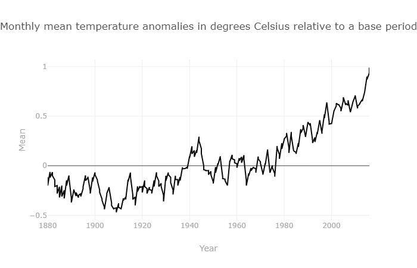
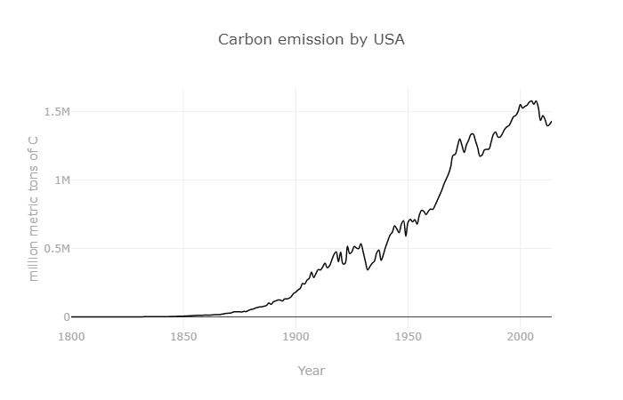
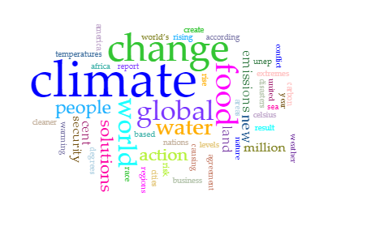
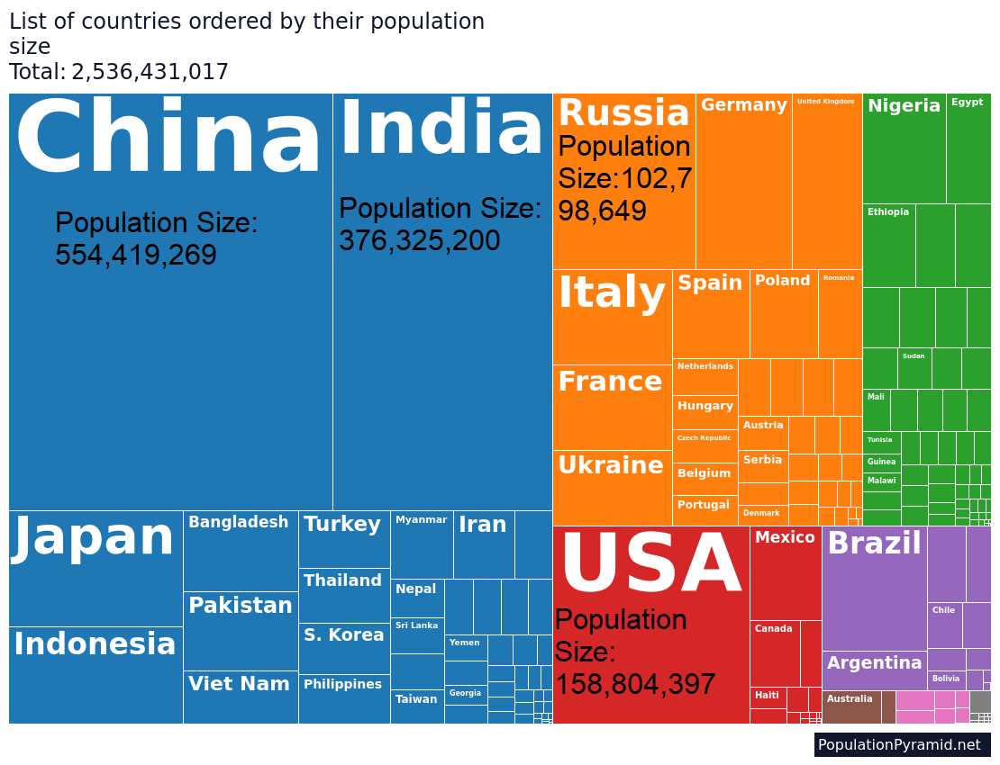

# ***Abstract***

This report will cover the current info available about the known effects of carbon emissions on our average global temperatures. There will mainly be a summarized discussion about how the correlation between these two is found, what kinds of effects are caused by this relation, and what is being done to reduce those aforementioned emissions.

# ***Introduction***

The looming threat of the climate crisis has become an increasingly common topic amongst the general populace over time, typically bringing heated discussions about what should be done or even whether or not it's real. It has gotten to a point where there are several organizations dedicated to finding or encouraging ways to prevent further damage, even those brought about by the actions of children[^1]. However, this report will not be focusing on the back and forth banter between peoples, but rather the effects of one of the biggest contributors to global pollution: fossil fuel emissions. We will be going over the levels of carbon emission via fossil fuels and its relation to the steadily increasing temperatures of the world. The burning of fossil fuels is one of the biggest factors considered when talking about the effects of climate change and as such, I found a direct correlation between the two to be an interesting topic to research. The studies used for the basis of my research were those of data collection of the past several decades. These collections recorded the levels of carbon emission throughout the world as a whole in addition to a per country, and another collection of data detailing the shifts in average global temperature all over the same time period. Both for those who care for these issues and those who do not, I believe that showing a direct correlation in the patterns of the data that I have gathered would be an informing experience for any reader. I will start off by presenting the data that I have gathered in all forms, proceed to explain the patterns in each set of data, and then explain the relativity between the aforementioned sets. 

*Figure 1: Fridays For Future, an organization created to support the fight against the threat of climate change.*

# ***Methodology***

## ***I. 	Participants:***
The participants in this experiment are the countries of the world (e.g. China, United States of America, Canada, etc.) as the data used in this experiment is separated by country. Of these participants the largest contributors to the creation of carbon emission via fossil fuels were China by an incredibly wide margin and then the United States. Since my experiment is about the direct correlation between carbon emissions via fossil fuels and the rising mean temperature of the world, these 2 countries are the demographics with the largest impact on the possible results.

## ***II. 	Apparatus and Materials:***
    Apparatus:
    - Computers
    - CO^2 Analyzers
    
    Materials:
    - Graphs (Emissions per Country in 2014, Global Temperature levels, and 2 largest contributors to emissions overtime)
	    - RAWGraphs and Excel used to recreate some of these graphs for better quality.

## ***III. Procedure:***

The experiment will involve the results of these graphs, the patterns in each individual graph, and the connecting the perceived patterns to each other to see if there’s a noticeable link between them. As they are the 2 biggest contributors in the initial graph of recorded emissions in 2014, the 3 countries I will use as specific examples will be China and the United States. As such, our independent variables will be the emissions created by these countries (dubbed Country Emissions) while our dependent variable will be the world’s mean temperature (dubbed Global Temperature). To begin, we will look at the graph of the emissions per country recorded in 2014. For the sake of relativity purely in terms of emissions produced, I have only included the countries with values on the graph that were 80,000 and above. 

.png)

*Figure 2: Countries with the 20 highest Carbon Emission values by 2014*

Looking at this graph (Figure 2) showcases the staggering difference in emission production when comparing China and the United States to practically every other country. They have emission values so large that their combined values still massively overwhelm the values of every other country combined. These values are the accumulated data on the carbon emissions of each country from as early as 1751 for some countries to 2014. Knowing our total values now, we will now view the data of the timeline of our global temperature overtime.

*Figure 3: Divergences from the global average temperature from 1880 to 2016.*

This graph showcases the annual changes in average global temperature from 1880 to 2016. It’s clear just from an immediate glance at this graph that the average global temperature increases as time progresses, though not in a straight line as there will always be outside factors that determine the weather and temperature of a certain year. With these 2 graphs along we can already see a connection between them, as emissions grew overtime, the mean global temperature rose as well. To better illustrate this connection, I will show the timelines of both China’s and the United States’ emissions. 

*Figure 4: Timeline of the USA'S Carbon Emissions from 1800 to 2016.*

*Figure 5: Timeline of China's Carbon Emissions from 1900 to 2016.*

With China’s timeline we can see that their emissions were fairly low for a longer time than the USA’s, but they have an explosive increase in production after the year 2000. With the USA’s timeline, it’s notable that they had a rather steady increase in emissions after around 1860 but these increases never really continued to slow down.

## ***Data Collection***

All the data used to create these graphs come from the same source: *DataHub*[^2]. More of the general information around the topic came from a mixture from articles and my own knowledge regarding the subject. However, to keep this section as objective as possible, I refrained from using too much of my own knowledge and relied mainly on the information I gathered from the aforementioned articles.

## ***Processing Data and Tool Use***

The only tools used to process the data were *RAWGraphs* to create any necessary graphs and *Microsoft Paint* to make any edits that I felt benefited the overall look of said graphs.

# ***Results & Discussion***

*Figure 6: Cirrus based on a United Nations article[^3]*

Even without the background knowledge of knowing that carbon emissions are a huge factor in global warming, it is clear that there is a relation between these collections of data. Early on in the global temperature timeline, the annual mean temperatures were typically colder than the overall mean but this started to change rather noticeably after the 1910s. If we look back at the graphs of China and the US as well, we notice that while China’s graph starts in the 1900s and grow rather slowly until around the 1960s and then exploding in production around the 2000s, the US’s graph starts far earlier in the 1800s and grows rather slowly until around the 1850s. While the US didn’t have as drastic of a sudden increase as China, the production they created would steadily increase over the course of these years and this increase really started to pick up stem a bit before the 1900s. I find that it is no coincidence that a start to the consistent increase in average global temperature was also around the time that the 2nd largest contributor of carbon emissions started to more steadily increase in emission production. The first time that the mean global temperature went above the average (in other words, was hotter than other years) was back in the 1940s and looking at China and the US at these times, it is rather easy to see why. Around this time, China had a small bump of increased emissions but nothing too drastic. However, at this same time the US was starting to reach one of its earliest peaks. This peak was followed by a temporary trough but then turned into a rapid increase rather quickly, shared with a beginning of noticeable increase in emissions from China as well. It is no surprise then that it was also around this time (the near 1960s) that would be another time for our global temperature to raise above the mean for a few years again. It is also after 1960 that our global temperature also steadily increases overall from then on out, being entirely above the mean post-1977.

To put it in shorter terms, the increases in global temperature have a direct correlation to the increases in global carbon emissions. The values of the average global temperature would generally rise in years that global carbon emissions were higher than usual and vice versa. It is because of this very notion that the mean temperature no longer even goes below 0 as carbon emission levels have grown dramatically over the past few decades, no longer allowing the mean temperature to drop to such a level. However, it is also using this data that makes the possibility of reducing these same levels a possibility in the future. As the mean temperature typically dropped along with lower CO2 levels, this means that reducing the world’s carbon emission rates should also come with an eventual reduction in temperature as well. While this is much easier said than done as the world has mostly progressed to a point where actions that produce these emissions are almost a necessity, we are also attempting to find alternative ways to perform these actions or even ways to rule out the need for them at all. These include alternate forms of energy (e.g., solar or wind), the integration of electric/hybrid cars, and reducing the need for deforestation by using alternate materials or ruling out some products altogether. There are even more methods that I haven’t mentioned and possibly more to come in the future, all for the sake of the planet.

# ***Analysis***

Going a bit further into the results discussed above, there are a number of factors that also go into what caused these increases in carbon emissions beyond simply one country creating more than the other. For example, we noted that there were steady increases in values amongst all graphs that generally began around 1946. This could be viewed as due to the "baby boom" that brought about a massive and steady increase in children and therefore, a massive and steady increase in carbon emissions as well. An increase in the amount of people on the planet would most defintely have carbon emissions follow suit as people themselves are emitters of carbon (in this case, carbon dioxide). Seeing as how the United States and China were 2 of the most populated countries in the world back in the 1950s[^4] (and still are today), it also appears that there is a direct correlation between population size and carbon emissions as well.

*Figure 7: Population Sizes in 1950s.*

 While this correlation would be a factor in the emissions of each country, it is certainly not the *largest* factor. This is because if it were the leading factor, then India would likely be a greater contributor of emissions than the US both back in the 1950s and now.

# ***Works Cited***

1.	“Fossil Fuels and Climate Change: The Facts.” ClientEarth, https://www.clientearth.org/latest/latest-updates/stories/fossil-fuels-and-climate-change-the-facts/. 
2.	Datopian. “Global Temperature Time Series.” DataHub, https://datahub.io/core/global-temp. 
3.	Datopian. “CO2 Emissions from Fossil Fuels since 1751, by Nation.” DataHub, https://datahub.io/core/co2-fossil-by-nation#resource-fossil-fuel-co2-emissions-by-nation. 
4. “The Climate Crisis – a Race We Can Win.” United Nations, United Nations, https://www.un.org/en/un75/climate-crisis-race-we-can-win. 
5. “Countries Ordered by Population in 1950.” PopulationPyramid.net, https://www.populationpyramid.net/population-size-per-country/1950/. 

# ***Notes***

[^1]: See https://fridaysforfuture.org/
[^2]: See https://datahub.io/core/co2-fossil-by-nation#resource-fossil-fuel-co2-emissions-by-nation
[^3]: See https://www.un.org/en/un75/climate-crisis-race-we-can-win
[^4]: See https://www.populationpyramid.net/population-size-per-country/1950/