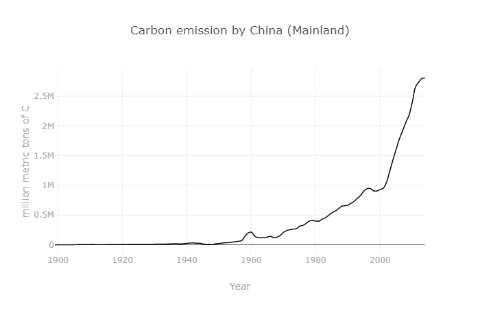

# ***Abstract***

This report will cover the current info available about the known effects of carbon emissions on our average global temperatures. There will mainly be a summarized discussion about how the correlation between these two is found, what kinds of effects are caused by this relation, and what is being done to reduce those aforementioned emissions.

# ***Introduction***

The looming threat of the climate crisis has become an increasingly common topic amongst the general populace over time, typically bringing heated discussions about what should be done or even whether or not it's real. It has gotten to a point where there are several organizations dedicated to finding or encouraging ways to prevent further damage, even those brought about by the actions of children[^1]. However, this report will not be focusing on the back and forth banter between peoples, but rather the effects of one of the biggest contributors to global pollution: fossil fuel emissions. We will be going over the levels of carbon emission via fossil fuels and its relation to the steadily increasing temperatures of the world. The burning of fossil fuels is one of the biggest factors considered when talking about the effects of climate change and as such, I found a direct correlation between the two to be an interesting topic to research. The studies used for the basis of my research were those of data collection of the past several decades. These collections recorded the levels of carbon emission throughout the world as a whole in addition to a per country, and another collection of data detailing the shifts in average global temperature all over the same time period. Both for those who care for these issues and those who do not, I believe that showing a direct correlation in the patterns of the data that I have gathered would be an informing experience for any reader. I will start off by presenting the data that I have gathered in all forms, proceed to explain the patterns in each set of data, and then explain the relativity between the aforementioned sets. 

*Figure 1: Fridays For Future, an organization created to support the fight against the threat of climate change.*

# ***Methodology***

## ***I. 	Participants:***
The participants in this experiment are the countries of the world (e.g. China, United States of America, Canada, etc.) as the data used in this experiment is separated by country. Of these participants the largest contributors to the creation of carbon emission via fossil fuels were China by an incredibly wide margin and then the United States. Since my experiment is about the direct correlation between carbon emissions via fossil fuels and the rising mean temperature of the world, these 2 countries are the demographics with the largest impact on the possible results.

## ***II. 	Apparatus and Materials:***
    Apparatus:
    - Computers
    - CO^2 Analyzers
    
    Materials:
    - Graphs (Emissions per Country in 2014, Global Temperature levels, and 2 largest contributors to emissions overtime)
	    - RAWGraphs and Excel used to recreate some of these graphs for better quality.

## ***III. Procedure:***

The experiment will involve the results of these graphs, the patterns in each individual graph, and the connecting the perceived patterns to each other to see if there’s a noticeable link between them. As they are the 2 biggest contributors in the initial graph of recorded emissions in 2014, the 3 countries I will use as specific examples will be China and the United States. As such, our independent variables will be the emissions created by these countries (dubbed Country Emissions) while our dependent variable will be the world’s mean temperature (dubbed Global Temperature). To begin, we will look at the graph of the emissions per country recorded in 2014. For the sake of relativity purely in terms of emissions produced, I have only included the countries with values on the graph that were 80,000 and above. 

.png)

*Figure 2: Countries with the 20 highest Carbon Emission values by 2014*

Looking at this graph (Figure 2) showcases the staggering difference in emission production when comparing China and the United States to practically every other country. They have emission values so large that their combined values still massively overwhelm the values of every other country combined. These values are the accumulated data on the carbon emissions of each country from as early as 1751 for some countries to 2014. Knowing our total values now, we will now view the data of the timeline of our global temperature overtime.

*Figure 3: Divergences from the global average temperature from 1880 to 2016.*

This graph showcases the annual changes in average global temperature from 1880 to 2016. It’s clear just from an immediate glance at this graph that the average global temperature increases as time progresses, though not in a straight line as there will always be outside factors that determine the weather and temperature of a certain year. With these 2 graphs along we can already see a connection between them, as emissions grew overtime, the mean global temperature rose as well. To better illustrate this connection, I will show the timelines of both China’s and the United States’ emissions. 

*Figure 4: Timeline of the USA'S Carbon Emissions from 1800 to 2016.*

*Figure 5: Timeline of China's Carbon Emissions from 1800 to 2016.*

With China’s timeline we can see that their emissions were fairly low for a longer time than the USA’s, but they have an explosive increase in production after the year 2000. With the USA’s timeline, it’s notable that they had a rather steady increase in emissions after around 1860 but these increases never really continued to slow down.

## ***Data Collection***

Describe where the data came from.[^fn1]

## ***Processing Data and Tool Use***

# ***Results***

These are my results.

# ***Analysis***

This is my analysis.

# ***Discussion***

This is my discussion.

# ***Works Cited***

*Various works cited here.*

# ***Notes***

* [^fn1]: See https://wikipedia.org.
* [^1]: https://fridaysforfuture.org/